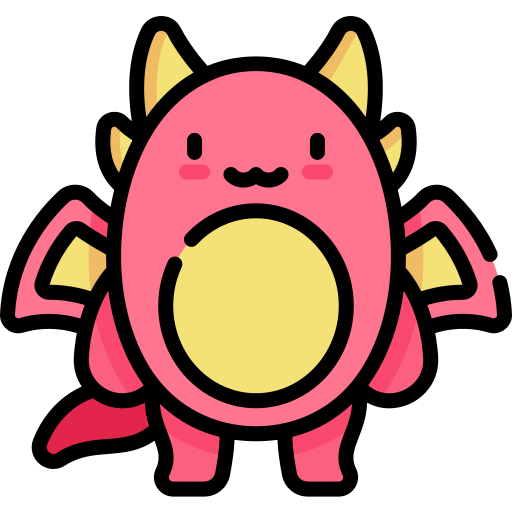

# BoardToim

**BoardToim** é um jogo de tabuleiro multiplayer baseado em navegador que oferece uma experiência de combate estratégico com diferentes tipos de peças e regras de eliminação. Desenvolvido com tecnologias modernas, como Bootstrap, jQuery e PeerJS, **BoardToim** permite que dois jogadores conectem-se remotamente para batalhas intensas em um tabuleiro dinâmico.

## Índice

- [Funcionalidades](#funcionalidades)
- [Configuração e Execução](#configuração-e-execução)
- [Regras do Jogo](#regras-do-jogo)
- [Estrutura do Projeto](#estrutura-do-projeto)
- [Tecnologias Usadas](#tecnologias-usadas)
- [Licença](#licença)

## Funcionalidades

- **Multiplayer Peer-to-Peer**: Conexão entre dois jogadores usando IDs de sessão gerados via PeerJS.
- **Interface Responsiva**: Layout adaptável para dispositivos móveis e desktops, utilizando Bootstrap.
- **Regras Customizáveis**: Cada peça possui um conjunto específico de regras para movimentação e ataque.
- **Timer de Turno**: Limite de 20 segundos para cada jogador realizar uma ação, destacando a vez ativa.
- **Modal Interativo**: Modal de confirmação e exibição de informações de jogo.
- **Cores Dinâmicas das Peças**: Peças coloridas com atributos específicos que são sorteados a cada nova partida.

## Configuração e Execução

1. **Clone o repositório**:
   ```bash
   git clone https://github.com/seuusuario/BoardToim.git
   cd BoardToim
   ```

2. **Instale as Dependências**: O projeto utiliza CDNs para as bibliotecas externas, portanto, não há dependências adicionais.

3. **Execute o Jogo**:
   Abra o arquivo `index.html` em seu navegador ou utilize uma extensão de servidor local no VSCode para visualizar o jogo.

## 🏰 Regras do Jogo

Cada jogador comanda um exército de peças lendárias, cada uma com habilidades especiais e destemidas. Prepare-se para uma batalha épica:

-  **Guerreiros (4 peças)**: Esses bravos lutadores são durões, sempre prontos para esmagar qualquer outro Guerreiro que entre em seu caminho... e até encarar o temível Dragão!

-  **Magos (2 peças)**: Mestres das artes místicas, os Magos são ardilosos! Com seus feitiços, eles podem desintegrar outros Magos ou até acabar com os orgulhosos Guerreiros. Mas cuidado: eles são poderosos, mas não invencíveis!

-  **Morte (2 peças)**: Implacável e sinistra, a Morte não faz distinção. Derrota qualquer um que ousar desafiá-la... só que paga o preço final e vai junto! Escolha bem quando libertar esse poder sombrio.

-  **Dragão (1 peça)**: A fera suprema, temida por todos no campo de batalha! O Dragão incinera qualquer peça que cruze seu caminho, mas até ele deve temer a presença da Morte. Use-o com sabedoria e terror!

---

⚔️ **Aviso de Guerra**: Quando a batalha termina e um jogador conquista a vitória, o jogo começa novamente, mas o caos do destino move todas as peças. Cada nova batalha traz surpresas!


## Estrutura do Projeto

```plaintext
BoardToim/
├── index.html          # Estrutura principal da aplicação
├── src/
│   ├── app.js          # Lógica do jogo e manipulação de eventos
├── styles/
│   └── style.css       # Estilos customizados para o jogo
└── README.md           # Documentação do projeto
```

## Tecnologias Usadas

- **HTML5 & CSS3**: Estrutura e estilização da interface do jogo.
- **Bootstrap 5**: Para o design responsivo e componentes UI.
- **jQuery 3.6.0**: Manipulação DOM simplificada.
- **PeerJS 1.5.0**: Implementação de comunicação peer-to-peer para conectar jogadores.
- **JavaScript ES6+**: Lógica de jogo e manipulação de eventos.

## Licença

Distribuído sob a licença MIT. Veja `LICENSE` para mais informações.
